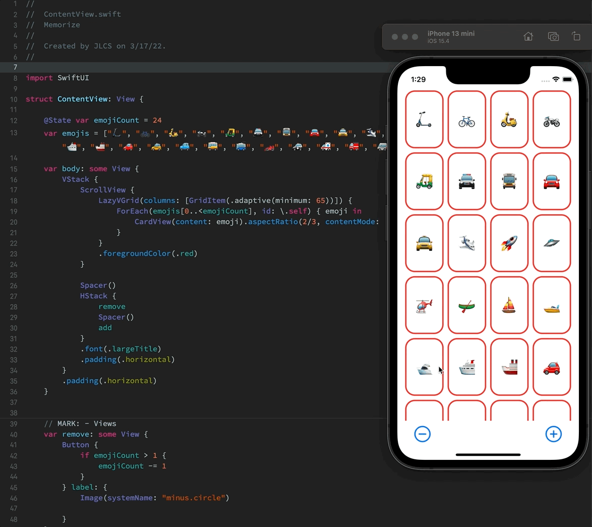

# Lecture #2: Learning more about SwiftUI

## Notes

## This lecture mentioned a lot of fundamental things about the SwiftUI which are:

### SwiftUI Three Distinct Stacks
- HStack - arrange its subviews in horizontal
- VStack - arrange its subviews in vertical
- ZStack - arrange its subviews on top of each other


### Building reusable SwiftUI Views

If you see yourself repeating codes in creating view, it's about time to make that view reusable by creating its own Struct View.

In the lecture, we make a CardView reusable:

```swift
struct ContentView: View {
	var body: some View {
		HStack {
			CardView()
			CardView()
			CardView()
		}
	}
}

struct CardView: View {
    var body: some View {
    	ZStack {
    		let shape = RoundedRectangle(cornerRadius: 20)
        	shape.fill().foregroundColor(.white)
			shape.strokeBorder(lineWidth: 3)
			Text("🚀").font(.largeTitle)	
    	}
        
    }
}
```


### How to view app on Light and Dark Mode in the Preview
In this lecture, we learned how to view your app on `dark` and `light` mode if you want to:


```swift
struct ContentView_Previews: PreviewProvider {
    static var previews: some View {
        ContentView()
            .preferredColorScheme(.dark)
        
        ContentView()
            .preferredColorScheme(.light)
    }
}
```


### How to run app in the Preview

Simply by clicking the _Play_ button on top of the device simulator in the Preview


### ViewBuilders

This is used extensively in SwiftUI to let you create new on-screen views by just listing them out in a trailing closure

### Using `if-else statement` in setting views

In this lecture, we also learned that we can use `if-else` statement in updating a certain view if we need to:

```swift
struct CardView: View {
    var content: String
    @State var isFaceUp: Bool = true
    
    var body: some View {
        ZStack {
            let shape = RoundedRectangle(cornerRadius: 20)
            if isFaceUp {
                shape.fill().foregroundColor(.white)
                shape.strokeBorder(lineWidth: 3)
                Text(content).font(.largeTitle)
            } else {
                shape.fill()
            }
        }
        .onTapGesture {
            isFaceUp.toggle()
        }
    }
}
```

### Using ForEach, Identifiable

SwiftUI has a `ForEach` keyword which is commonly used in creating multiple views easily like:

```swift
ForEach(emojis[0..<emojiCount], id: \.self) { emoji in
	CardView(content: emoji).aspectRatio(2/3, contentMode: .fit)
}
```


### Introduction on LazyVGrid

This lecture introduced how we can use LazyVGrid easily in arranging subviews in a _grid_ that grows vertically

```swift
LazyVGrid(columns: [GridItem(.adaptive(minimum: 65))]) {
    ForEach(emojis[0..<emojiCount], id: \.self) { emoji in
        CardView(content: emoji).aspectRatio(2/3, contentMode: .fit)
    }
}
```

## Screenshots:
<!--  -->
